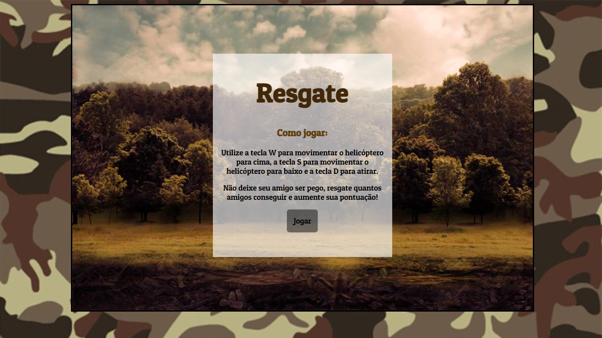

# Resgate - Jogo de Naves
Esse projeto foi desenvolvido com a ajuda das aulas Construindo o seu primeiro jogo de naves da DIO.

Para o desenvolvimento do projeto foi utilizado conhecimentos de HTML, CSS e JavaScript. 

O jogo pode ser acessado por um navegador de internet.

