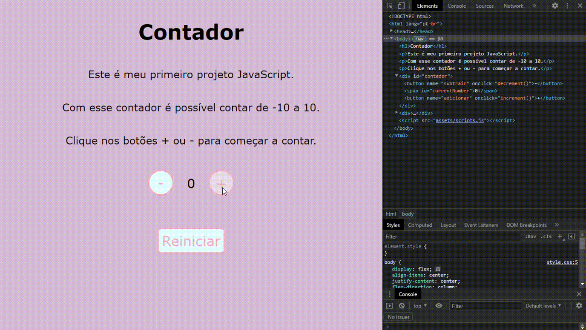

# Primeiro Projeto JavaScript - Contador
Este projeto foi desenvolvido durante as aulas de Introdução ao JavaScript na plataforma DIO, ministradas por Stephany Nusch.
A criação do projeto teve o objetivo de se familiarizar com a linguagem JavaScript.

